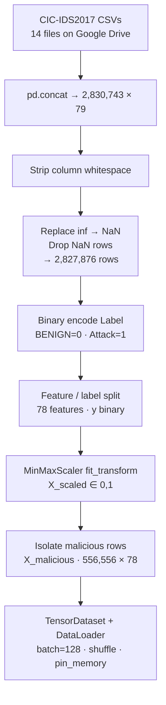
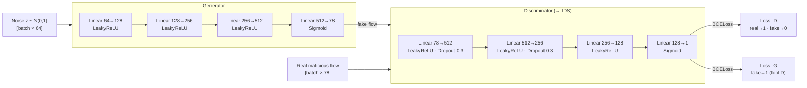
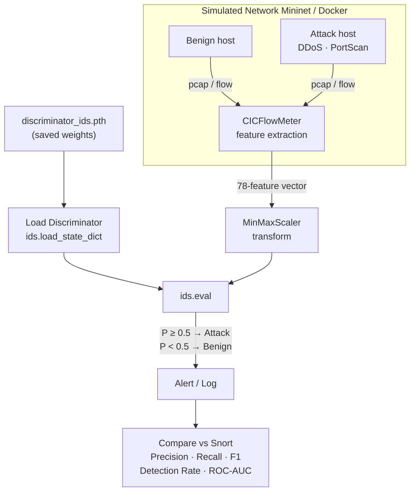

# Janus IDS — GAN-Based Adaptive Network Intrusion Detection System

---

## 1. Overview

Modern network intrusion detection systems fall into two broad camps: signature-based tools such as Snort, which match traffic against a library of known attack patterns, and anomaly-based classifiers, which model normal behaviour and flag deviations. Both approaches share a fundamental weakness — they are reactive. Signature tools cannot detect what they have never seen, and anomaly detectors trained on static datasets degrade as network traffic evolves. Janus IDS addresses this by repurposing a **Generative Adversarial Network** as a detection engine. A Generator neural network learns to synthesise realistic malicious traffic — DDoS floods, SYN floods, and port-scanning patterns — from random noise, while a Discriminator neural network learns to tell real attack traffic from Generator fakes. Because the Discriminator must continuously adapt to increasingly convincing forgeries, it develops a richer, more generalised representation of what attack traffic looks like at the feature level. After adversarial training concludes, the Generator is discarded and the Discriminator is detached and deployed as a standalone binary IDS classifier. This competitive training dynamic is what gives Janus IDS its capacity to recognise zero-day and novel attacks it was never explicitly shown, distinguishing it from every prior GAN-IDS work that used the Generator output as the end product rather than the Discriminator itself.

---

## 2. Data Pipeline

The CIC-IDS2017 dataset contains 14 attack categories across 78 network-flow features. Raw CSVs carry leading spaces in column names and infinity values in throughput columns — both are corrected before scaling. The MinMaxScaler is fitted on the full dataset so the Discriminator sees a consistent feature space during both training and Phase 2 inference.

---

## 3. GAN Architecture & Adversarial Training

Training alternates two Adam optimisers (lr = 0.0002, β₁ = 0.5) across 50 epochs on 556,556 malicious samples. The Discriminator step minimises the average of real-traffic loss and fake-traffic loss; the Generator step maximises the probability that its output is classified as real. After 50 epochs: Loss_D ≈ 0.36, Loss_G ≈ 1.55 — both approaching Nash equilibrium (0.693).

---

## 4. Phase 2 — Deployment & Detection

The saved Discriminator is loaded into a Python inference script running alongside a Mininet network simulation. CICFlowMeter extracts the same 78 features from live packet captures in real time. Each flow vector is scaled with the Phase 1 MinMaxScaler and passed through the Discriminator; a sigmoid output ≥ 0.5 triggers an alert. Performance is benchmarked against a parallel Snort instance operating under identical traffic conditions.

---

## 5. Evaluation & Expected Outcomes

Performance is measured on a hold-out set stratified across three traffic classes: benign, known attacks (from CIC-IDS2017), and Generator-synthesised novel attacks that Snort has no signature for. Primary metrics are Precision, Recall, F1-score, Detection Rate, and ROC-AUC. The hypothesis is that the adversarially hardened Discriminator will outperform Snort on novel attack detection while maintaining comparable false-positive rates on benign traffic. Secondary analysis compares inference latency to assess real-time viability. All results are targeted for formal publication as a conference paper, with the GAN weights, inference script, and evaluation code released publicly.

---

## Image Placement Guide

| # | Image | Source | Where to place |
|---|-------|---------|----------------|
| 1 | **Data Pipeline flowchart** | Mermaid diagram in Section 2 | Below Section 2 heading |
| 2 | **GAN Architecture & Training Loop** | Mermaid diagram in Section 3 | Below Section 3 heading |
| 3 | **GAN Loss Curves** (Generator vs Discriminator over 50 epochs) | Notebook cell-23 output screenshot | Inline in Section 3, after training results text |
| 4 | **Phase 2 Deployment flowchart** | Mermaid diagram in Section 4 | Below Section 4 heading |
| 5 | **Attack Type Distribution bar chart** | Notebook cell-13 output screenshot | Inline in Section 2, illustrating class imbalance |
