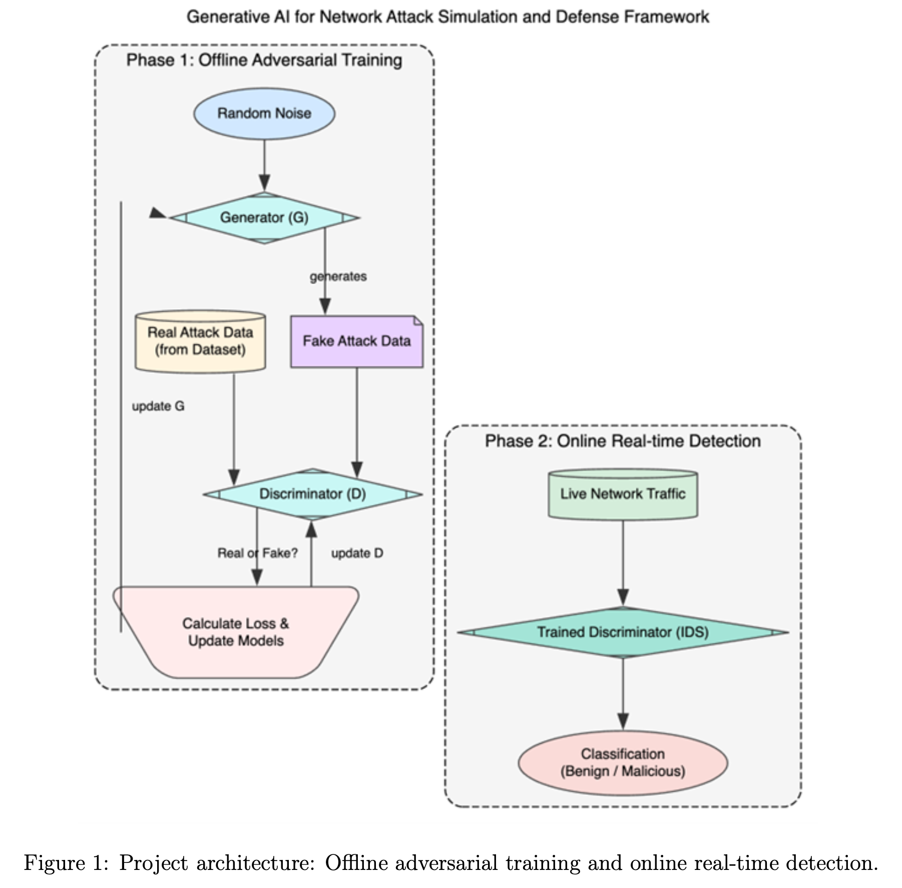

# janus-ids
- A proactive, adaptive defence mechanism built on Generative Adversarial Networks (GANs).
- An IDS that can anticipate and neutralise threats it has never previously encountered.
- Conventional models like Support Vector Machines (SVM) and Random Forests have supported anomaly detection—but depend on high-quality, comprehensive training data.
- Using the GAN’s discriminator as the detection system itself, setting it apart from prior works focused only on testing.
- While established, signature-based tools like Snort remain limited; this project will directly compare the GAN-based approach and traditional baselines.

**Objectives:**
	1. Design and develop a GAN capable of generating synthetic, plausible malicious net- work traffic (e.g., for DDoS or port scanning).
	2. Train the GAN’s discriminator to serve as an adaptive IDS, able to distinguish benign, known, and novel (AI-generated) attack traffic.
	3. Build a simulated network environment (using Mininet, Docker, etc.) for comprehensive performance testing.
	4. Conduct a comparative analysis of detection rate, precision, and recall against a signature-based IDS (Snort).

- Attack types: UDP/SYN flood DDoS and network port scanning.
- Datasets: CIC-IDS and NSL-KDD.

**Proposed Methodology:** 
1. Data Preparation:
	- Pre-process a chosen dataset (e.g., CIC-IDS2017): cleaning, normalisation, and encoding; label samples as ‘benign’ or ‘malicious’.
2. GAN Architecture Development:
	- Use Python with TensorFlow or PyTorch to build:  
		- Generator: Takes random noise and outputs packets mimicking malicious traffic.
		- Discriminator: Neural classifier distinguishing genuine malicious traffic and synthetic packets.
3. Adversarial Training:
	- Train Generator and Discriminator in a competitive “game.” Each network improves by outwitting the other, resulting in sophisticated attack simulation and robust detection.
4. Evaluation:
	- Detach and deploy the trained Discriminator as the IDS.
	- Test with a hold-out set containing benign, known, and GAN-generated attacks.
	- Benchmark (accuracy, detection rate) versus Snort under the same simulated environment.



**The architecture comprises:**
- Offline phase: Adversarial training between the Generator and Discriminator.
- Online phase: Deploy the trained Discriminator for real-time detection.

**Expected Outcomes:**
1. A functional GAN model capable of generating valid, novel network attack packets that challenge traditional detection.
2. A highly adaptive IDS (trained Discriminator) demonstrating superior detection rates for zero-day/novel attacks compared to Snort.
3. Comprehensive performance analysis—metrics like precision, recall, F1-score, and ROC curves—for empirical validation.
4. Proof-of-concept demo: Generating and detecting attacks in simulation.
5. Results suitable for formal publication as a research paper.


==***GAN-Based Network Intrusion Detection System for Supervisory Control and Data Acquisition System | Conference Paper · November 2024***==


**APPROACH:**
1. **Google Colab:** For all data processing, GAN model building, and training.
2. **Local Machine/VM:** For the network simulation, model deployment, and comparative testing against Snort.

**FRAMEWORK: PyTorch** 

Install Core Libraries: Install essential data science libraries.
```bash
pip install pandas numpy scikit-learn matplotlib seaborn
```

DATASET : CIC-IDS2017

Phase 1: Offline Model Development (The GAN): Data Processing -> Building GAN Architecture -> Adversarial Training Loop Implementation
Phase 2: Online Detection and Evaluation


Google Colab: For all data processing, GAN model building, and training.
Local Machine/VM: For the network simulation, model deployment, and comparative testing against Snort.

Current Goals:
PHASE 1:
        1. Setup Colab Env
        2. Data Processing
        3. GAN Training
        4. Generate Novel Attack Data